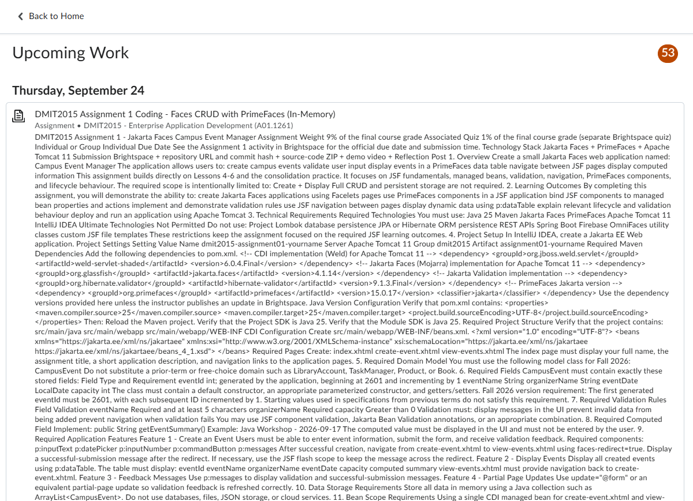
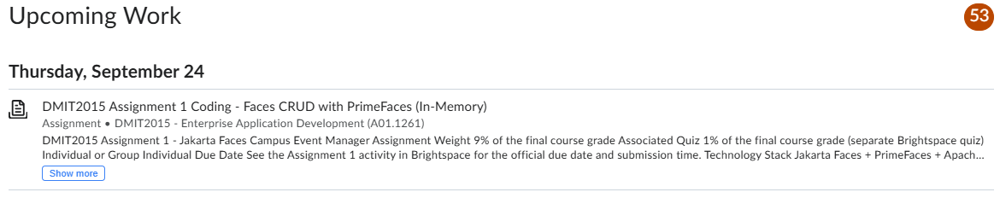

# Brightspace TL;DR

A Chrome extension that collapses gigantic Brightspace assignment descriptions so you can actually see what's due.

## Before

## After

## Install

1. Download or clone this repo
2. Open `chrome://extensions`
3. Turn on **Developer mode** (top right)
4. Click **Load unpacked** and select the `brightspace-tldr-extension` folder
5. Refresh your Work To Do page

## Customize

Change `LINES` at the top of `content.js` to show more or fewer lines per description.

Built for NAIT (`lms.nait.ca`). To use it on another school's Brightspace, update the URL in `manifest.json`.
