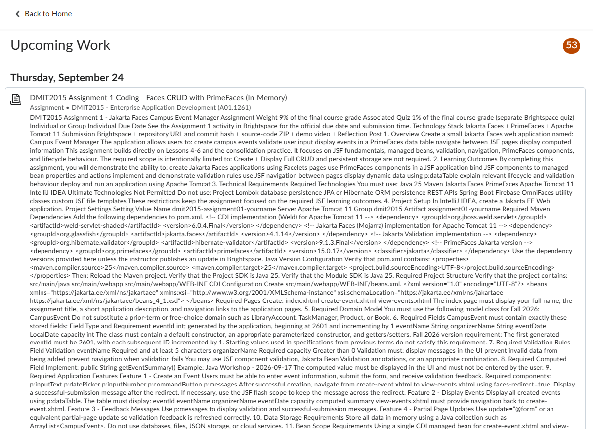
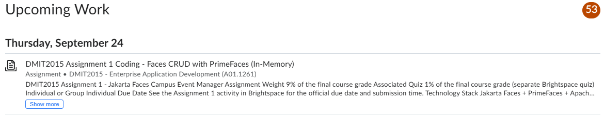

# Brightspace TL;DR

A Chrome extension that collapses gigantic Brightspace assignment descriptions so you can actually see what's due.

## Before

## After

## Install

1. Download or clone this repo
2. Open `chrome://extensions`
3. Turn on **Developer mode** (top right)
4. Click **Load unpacked** and select the `brightspace-tldr-extension` folder
5. Refresh your Work To Do page

## Board

The full Work To Do page (**View all work** on the homepage widget) gets a **List | Board** switch.

- **Group by** Status (drag cards between To Do, In Progress and Done), Class, or Week (Overdue, This week, Next week, Later)
- Filter by class with the colored chips; cards sort by due date
- Each card has a countdown badge (LATE, TODAY, 3d), a note field, and Hide
- **Reset to defaults** clears every status, note and hidden item

Brightspace splits Work To Do into pages, so open each page once and the board remembers what it saw. Everything is stored locally in your browser. Brightspace doesn't show whether you've submitted something, so marking work Done is up to you.

Run the date tests with `node brightspace-tldr-extension/dates.test.js`.

## Customize

Change `LINES` at the top of `content.js` to show more or fewer lines per description.

Built for NAIT (`lms.nait.ca`). To use it on another school's Brightspace, update the URL in `manifest.json`.
